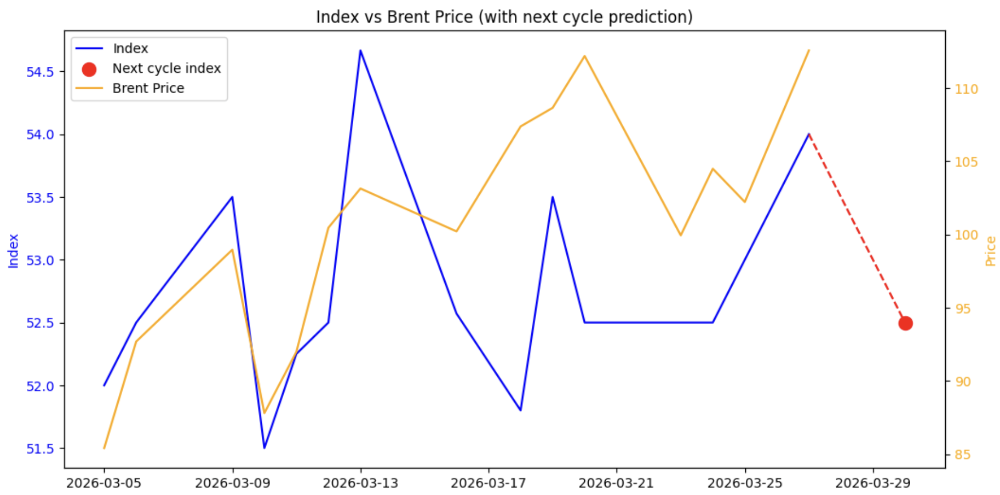

# Trending News

A notebook-based data science project for predicting short-term market direction from Russian financial news using transformer-based sentiment classification.

## Overview

This project fine-tunes a compact RuBERT model on labeled news texts and classifies each article into one of three classes:

- `0` — **Increase**
- `1` — **Stable**
- `2` — **Decrease**

The predictions are then aggregated by date and combined with market data to build a simple trend indicator and backtesting workflow.

## Project goals

- clean and normalize financial news text
- train a Russian-language NLP classifier
- evaluate model quality with standard classification metrics
- aggregate news predictions into a daily indicator
- compare signals with Brent market data


## Data

The training workflow in [eval_model.ipynb](src/eval_model.ipynb) uses a labeled Excel dataset:

- `data/text_corpus_news.xlsx` — training corpus referenced in the notebook
- [data/brent_march_2026.xls](data/brent_march_2026.xls) — market data used for analysis

> Note: the Excel corpus is referenced in the notebook but is not included in the current repository snapshot.

## Methodology

The training notebook [main.ipynb](src/main.ipynb) performs the following steps:

1. loads the annotated dataset
2. builds a single target label from `Increase`, `Stable`, and `Degrease`
3. removes noisy text fragments and formatting artifacts
4. splits the data into train / validation / test subsets
5. tokenizes text with `cointegrated/rubert-tiny`
6. fine-tunes a sequence classification model
7. saves trained weights to [models/model_rubert-tiny1](models/model_rubert-tiny1)

The custom dataset wrapper is [`CustomDataset`](src/eval_model.ipynb), and evaluation is computed in [`compute_metrics`](src/eval_model.ipynb).

## Model

- **Base model:** `cointegrated/rubert-tiny`
- **Framework:** PyTorch + Hugging Face Transformers
- **Task:** multi-class text classification
- **Classes:** increase / stable / decrease
- **Training setup:** mixed precision enabled (`fp16=True`)

## Installation

Install dependencies from [requirements.txt](requirements.txt):

```bash
pip install -r requirements.txt
```

For notebook execution and Excel loading, the following may also be needed:

```bash
pip install jupyter openpyxl
```

## How to run

### 1. Train the model

Open [eval_model.ipynb](src/eval_model.ipynb) and run the cells in order.

### 2. Run inference and analysis

Open [main.ipynb](src/main.ipynb) to test the end-to-end workflow, including:

- [`run_pipeline`](src/main.ipynb)
- [`detect_trend`](src/main.ipynb)
- [`merge_with_market`](src/main.ipynb)
- [`generate_signals`](src/main.ipynb)

## Example: load saved weights

```python
import torch
from transformers import BertTokenizerFast, BertForSequenceClassification

tokenizer = BertTokenizerFast.from_pretrained("cointegrated/rubert-tiny")
model = BertForSequenceClassification.from_pretrained(
    "cointegrated/rubert-tiny",
    num_labels=3
)

model.load_state_dict(torch.load("models/model_rubert-tiny1", map_location="cpu"))
model.eval()
```

## Evaluation

The project tracks the following metrics during validation:

- Accuracy
- F1-score
- Precision
- Recall

See the metric calculation in [`compute_metrics`](src/eval_model.ipynb) and the reported outputs in [eval_model.ipynb](src/eval_model.ipynb).

## Visualization
An example of calculating the indicator relative to Brent for March 2026:


## Limitations

- notebook-centric workflow
- training corpus is not stored in the repository
- compact model chosen for limited resources rather than maximum accuracy
- current pipeline is research-oriented and should be validated further before production use

## Future improvements

- move preprocessing and inference into reusable Python modules
- add experiment tracking and configuration files
- improve train/validation/test splitting strategy
- add CLI or API for inference
- document final benchmark results in a separate report

## License

Distributed under the [MIT License](LICENSE).
